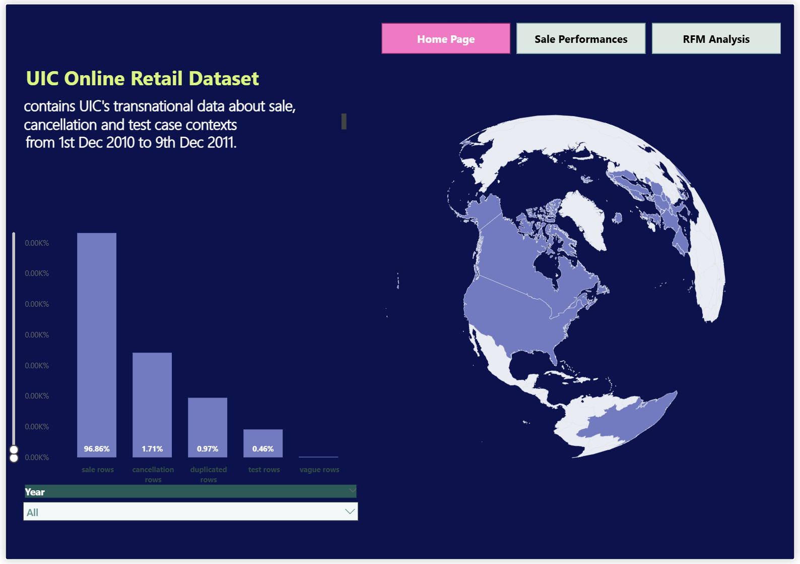
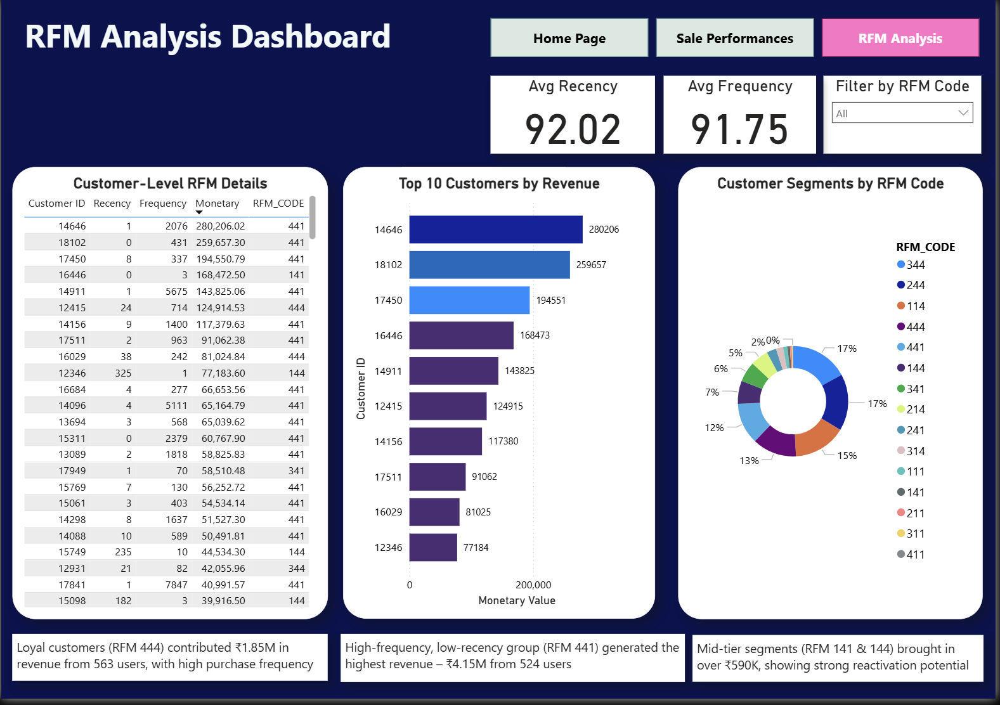
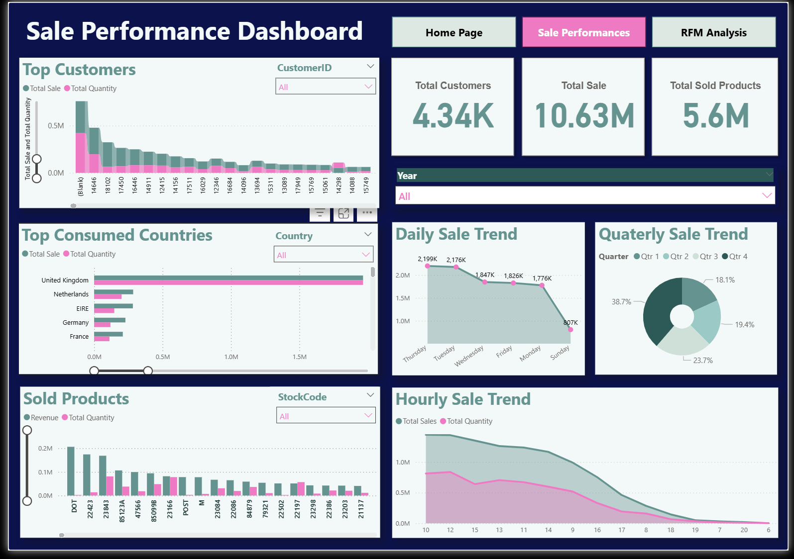

# Customer Segmentation — RFMT + K-Means Clustering

> End-to-end customer segmentation on the **UCI Online Retail** dataset (~541K transactions from a UK online retailer, Dec 2010 – Dec 2011). Extends classical RFM analysis with **Tenure** (RFMT), applies **K-Means clustering**, and delivers a **Jupyter analysis**, an **interactive Power BI dashboard**, and a **Streamlit live predictor**.


---

## 🎯 Highlights

- **3 customer segments** identified via K-Means (k=3 chosen via elbow method, validated against k=4 using silhouette scores)
- **RFMT methodology** — extends classical RFM with **Tenure** (days as customer) for richer lifecycle signals
- **Three deliverables** — notebook analysis, Power BI dashboard, live Streamlit predictor
- **Actionable marketing playbook** — concrete campaigns per segment (VIP rewards, nurture, win-back)
- **Cohort analysis** with retention heatmaps to frame the clustering work

## 🧩 Segment profiles

| Segment | Behavior | Marketing play |
|---|---|---|
| 👑 **Champions** | High frequency · high spend · recent activity · long tenure | VIP rewards, early access, premium launches, loyalty tiers |
| ⭐ **Promising** | Medium values across all RFMT metrics — emerging loyal customers | Nurture flows, cross-sell, personalized recommendations |
| ⚠️ **At Risk** | High recency (inactive), lower frequency — early churn signals | Win-back campaigns, retention offers, re-engagement emails |

The **Champions** segment concentrates the majority of revenue (Pareto in action) — the core insight driving the marketing recommendations in the notebook.

## 🧪 Methodology

1. **Load & clean** — UCI Online Retail (~541K rows); drop returns, invalid IDs, zero-price rows
2. **Cohort analysis** — monthly cohorts, retention heatmap, average-revenue-per-cohort evolution
3. **Compute RFMT** per customer — Recency, Frequency, Monetary, Tenure
4. **Traditional RFM baseline** — quartile scoring → Gold / Silver / Bronze (for comparison)
5. **Preprocess for K-Means** — `log(x + 1)` to handle right skew, then `StandardScaler`
6. **Elbow method** — evaluate k ∈ [2, 10]
7. **Cluster** with k=3 (compared against k=4 via silhouette)
8. **Profile** — snake plots, relative-importance heatmaps, 3D scatter, sunburst
9. **Business interpretation** — name segments, compute revenue share, identify churn risk
10. **Export** — labeled customers (`customer_segments_analysis.csv`), trained `kmeans_model.pkl`, fitted `scaler.pkl` — consumed by the Streamlit app

## 🖼️ Power BI dashboard

### Home


### RFM analysis


### Performance


## 📂 Project contents

```
customer-segmentation-rfmt/
├── customer-segmentation.ipynb     # Main analysis notebook (80 cells, 13 sections)
├── app.py                          # Streamlit live RFMT → cluster predictor
├── kmeans_model.pkl                # Trained KMeans (k=3)
├── scaler.pkl                      # StandardScaler fitted on log-transformed RFMT
├── customer_segments_analysis.csv  # Labeled customers (final output)
├── OnlineRetailDashboard.pbix      # Interactive Power BI dashboard
├── screenshots/                    # Dashboard page captures
│   ├── home-page.png
│   ├── rfm-analysis.png
│   └── performances.png
├── requirements.txt
├── LICENSE
└── README.md
```

## 🚀 How to run

### 1. Install Python dependencies

```bash
pip install -r requirements.txt
```

### 2. Download the raw dataset

The raw `Online Retail.csv` (~44 MB) is not committed. Get it from UCI:

📦 [archive.ics.uci.edu/dataset/352/online+retail](https://archive.ics.uci.edu/dataset/352/online+retail)

Save it as `Online Retail.csv` in the repo root (same folder as the notebook).

### 3. Explore the analysis

```bash
jupyter notebook customer-segmentation.ipynb
```

The notebook ships with its outputs preserved, so you can read end-to-end without running it.

### 4. Launch the live predictor

```bash
streamlit run app.py
```

Enter a customer's Recency / Frequency / Monetary / Tenure values → instant cluster assignment with segment name and explanation. Loads the committed `kmeans_model.pkl` and `scaler.pkl`, so no retraining required.

### 5. Open the Power BI dashboard

Open `OnlineRetailDashboard.pbix` in **Power BI Desktop** to explore the interactive dashboard (Home, RFM Analysis, Performance pages).

## 🛠️ Tech stack

**Analysis:** Python · pandas · numpy · scikit-learn · matplotlib · seaborn · plotly · Jupyter
**App:** Streamlit
**Dashboard:** Power BI

## 📚 Dataset

[**Online Retail**](https://archive.ics.uci.edu/dataset/352/online+retail) — UCI Machine Learning Repository.
Transactions from a UK-based non-store online retailer (01 Dec 2010 – 09 Dec 2011). ~541K rows.

## 📝 License

[MIT](LICENSE)
